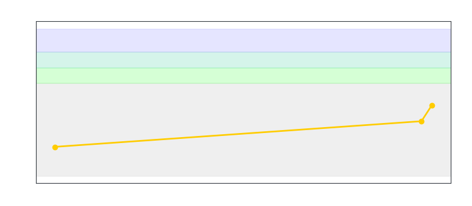

<h1 align="center">
  
</h1>

  

- 🎯 **Focus:** Competitive Programming | C++ | Data Structures & Algorithms

### 🏆 Achievements
- 🥇 **First Prize** - Provincial Olympiad in Informatics (2026)
- 🥈 **Second Prize** - Southern Region Youth Informatics Competition (2026)
- 🥉 **Third Prize** - Dong Nai Provincial Youth Informatics Competition (2026)
- 🏅 **Consolation Prize** - Provincial Olympiad in Informatics (2025)

---

### ⚔️ Codeforces Statistics & Progress

<table width="100%" border="0">
  <tr>
    <!-- Cột 1: Bảng Thống Kê Codeforces -->
    <td width="42%" align="center" valign="middle">
      
    </td>
    <!-- Cột 2: Biểu Đồ Đồ Thị Rating -->
    <td width="58%" align="center" valign="middle">
      
    </td>
  </tr>
</table>
